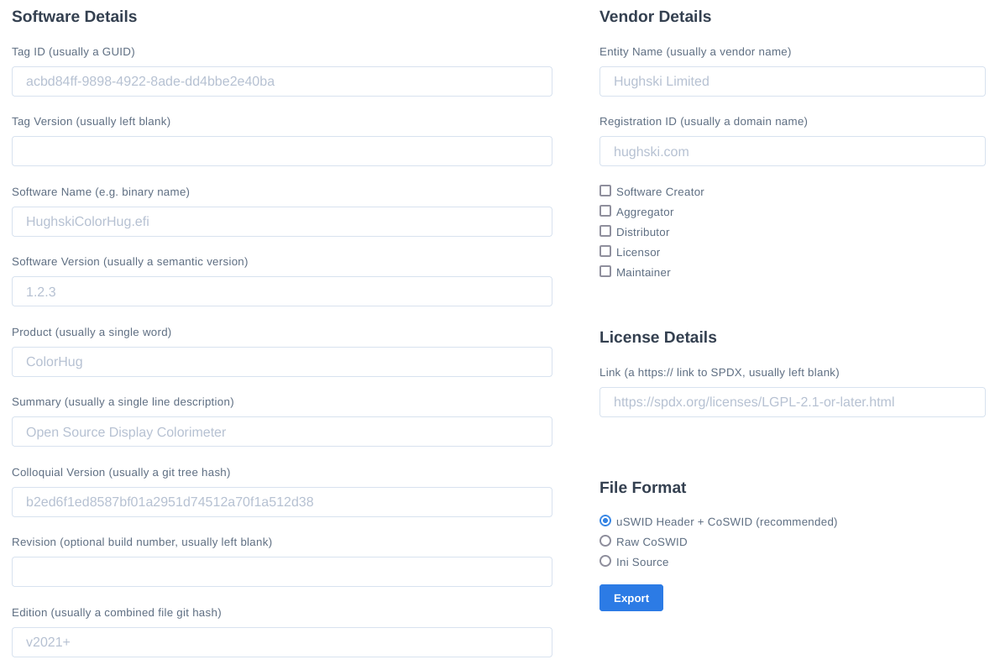

python-uswid
------------

# Introduction

A Software Bill of Materials (SBoM) is a manifest of what components are included inside your software.
It helps vendors and consumers keep track of software components for better software supply chain security.

When building or creating a SBoM there are lots of formats to choose from:

- [SWID](https://csrc.nist.gov/Projects/Software-Identification-SWID/guidelines)
- [coSWID](https://datatracker.ietf.org/doc/rfc9393/)
- [CycloneDX](https://cyclonedx.org/)
- [SPDX](https://spdx.dev/)
- [goSWID](https://github.com/veraison/swid)

Using the uSWID tool allows you to **create**, **convert** and **merge** SBoM metadata to and from most of those formats, with the initial focus being functionality useful for firmware files.

Additionally, uSWID supports importing SBoM metadata from a few additional file formats:

- `.ini` files -- designed to be easier for humans to write
- `pkgconfig` -- `.pc` files that are shipped with most open source libraries
- [PE binaries](https://learn.microsoft.com/en-us/windows/win32/debug/pe-format) -- coSWID metadata can be inserted in a `.sbom` section at link time
- unspecified firmware files -- using a 24 byte header to locate the coSWID CBOR SBoM entry

There are three elements of an SBoM that uswid supports. These are:

- Identities -- the *what*, describing the software subcomponents
- Entities -- the *who*, describing the company or person responsible for the identity in some way
- Payloads (optional) -- the *file* that we are referring to, for when the SBoM is not embedded

One of the core features of uswid is that you can import multiple files to build a single identity at construction time.

For instance, you could combine the pkgconfig `.pc` file, a `.exe` binary and `.ini` override to build one SBoM component. In most cases SBoM metadata is merged, but it can also be replaced.

There is also a [web-generator on the LVFS](https://fwupd.org/lvfs/uswid) that uses uSWID to easily build INI, coSWID and coSWID with uSWID header.

Some of the formats in further detail:

## SWID

Software Identification (SWID) tags provide an extensible XML-based structure to identify and describe individual software components, patches, and installation bundles.
SWID tag representations are too large for firmware with storage constraints, but is useful when importing the data into other programs and frameworks.

## coSWID

CoSWID supports a similar set of semantics and features as SWID tags, all in a more space efficient format known as [CBOR](https://cbor.io/).
This format is suitable for embedding into binary files, although the client then needs to be aware of the offset and length of the CBOR binary block of metadata.

If we know how to parse the firmware and can lookup the offset the coSWID blob starts and ends (e.g. the PE COFF header says *data is stored at 0x123, length is 0x234*) then embedding coSWID as CBOR data is appropriate.

## coSWID with uSWID header

If we are asked to process lots of different kinds of firmware, we do not always know how to parse the secret vendor-specific header, e.g.

| VENDOR_HDR | ARC_IMAGE | FREE_SPACE | coSWID | FREE_SPACE |
|------------|-----------|------------|--------|------------|

With this the SBoM builder tool does not know *where* the coSWID data starts in the blob, or *how many* coSWID sections there might be.
If we include a small header with a 16 byte *magic* identifier then we can search the image to discover the offsets to read the coSWID blobs.

The 24 byte uSWID header in full:

    uint8_t[16]   magic, "\x53\x42\x4F\x4D\xD6\xBA\x2E\xAC\xA3\xE6\x7A\x52\xAA\xEE\x3B\xAF"
    uint8_t       header version, typically 0x02
    uint16_t      little-endian header length, typically 0x17
    uint32_t      little-endian payload length
    uint8_t       flags
                    0x00: no flags set
                    0x01: zlib compressed payload

The uSWID header is automatically added when the file extension is `.uswid`, e.g.

    uswid --load payload.efi --load oem.ini --save ./blob.uswid

## INI File

It's sometimes much easier to use the simple key=vaue INI format when creating component SBoMs, or overriding specific values compared to building a new SWID XML document:

Let's create an example component SBoM, using the INI-file format:

    [uSWID]
    tag-id = acbd84ff-9898-4922-8ade-dd4bbe2e40ba
    software-name = HughskiColorHug
    software-version = 1.2.3
    version-scheme = multipartnumeric
    product = ColorHug
    summary = Open Source Display Colorimeter
    colloquial-version = b2ed6f1ed8587bf01a2951d74512a70f1a512d38 # of all the source files
    edition = v2021+ # identifier of the project tree, e.g. the output of 'git describe'
    revision = 2
    persistent-id = com.hughski.colorhug

    [uSWID-Entity:Distributor]
    name = Richard Hughes
    regid = hughsie.com
    extra-roles = Licensor,Maintainer,SoftwareCreator

The `tag-id` value has to be unique, but for UEFI firmware this is typically the ESRT GUID value.
The `product`, `summary`, `colloquial-version`, `revision` and `edition` values are optional but at least the first two are highly recommended.

If we are not including the SBoM into the binary, and instead building a *detached* component SBoM, we need to make sure that we can verify the blob is valid. To do this we can also add a file hash:

    [uSWID-Payload]
    name = HughskiColorHug.efi
    size = 20480
    hash = 5525fbd0911b8dcbdc6f0c081ac27fd55b75d6d261c62fa05b9bdc0b72b481f6

Or we can populate all the payload fields automatically:

    [uSWID-Payload]
    path = ../../build/src/ColorHug1/HughskiColorHug.efi

This can then be saved as `uswid.ini` and be built into **compressed** (and deduplicated) coSWID CBOR blob with a uSWID header:

    uswid --load uswid.ini --save ./HughskiColorHug.uswid --compress

You can also just append one entity to an existing CoSWID tag. This might be done by the ODM or OEM on firmware built by the IBV. Just create a `oem.ini` file with these contents:

    [uSWID-Entity:Distributor]
    name = OEM Vendor
    regid = oem.homepage.com

Which can be appended using:

    uswid --load HughskiColorHug.uswid --load oem.ini --save ./HughskiColorHug.uswid --compress

Usefully, if you load a uswid blob from an existing binary, the tag version is incremented when it is saved it again.
If that behaviour is wrong, set an explicit `tag-version` in the `[uSWID]` section.

# Adding Links

Dependancies like compilers or other security-relevant libraries can be added using:

    uswid --load uswid.ini compiler.ini --save ./example.uswid

Where we have added an extra link section in `uswid.ini`:

    [uSWID-Link:gcc]
    rel = see-also
    href = swid:077b4576-92f7-52fd-94eb-af9fc3d52c58

Where `compiler.ini` looks something like:

    [uSWID]
    tag-id = 077b4576-92f7-52fd-94eb-af9fc3d52c58
    software-name = gcc
    software-version = 12.1.1
    version-scheme = multipartnumeric

    [uSWID-Entity:TagCreator]
    name = Hughski Limited
    regid = hughski.com

...or for several dependencies that have been included into the firmware:

    [uSWID-Link:libpng]
    rel = requires
    href = swid:077b4576-92f7-52fd-94eb-af9fc3d52c58

    [uSWID-Link:libjpeg]
    rel = requires
    href = swid:3aab57c3-5661-5731-800d-db5a7f0886c1

NOTE: The GUID can be constructed from the tool or library name combined with the version, e.g. using the [web tool on the LVFS](https://fwupd.org/lvfs/guid).

...or, if a component has been previously defined, you can use the name to contruct the SWID automatically:

    [uSWID-Link:image_loading_lib]
    rel = requires
    href = swid:libjpeg

Alternatively, we can tell the user where to find the installation package:

    [uSWID-Link:src]
    rel = installationmedia
    href = https://github.com/intel/FSP/AmberLakeFspBinPkg

If the binary content is licensed in a permissive or open-source way it should be identified as such.
To do this, you can either use the SWID XML format:

    <SoftwareIdentity …>
    <Entity … />
    <Link rel="license" href="https://spdx.org/licenses/LGPL-2.1-or-later.html"/>
    </SoftwareIdentity>

Or the INI override format:

    [uSWID-Link]
    rel = license
    href = https://spdx.org/licenses/LGPL-2.1-or-later.html

# Reading and writing to PE files

By default, the uswid command line uses `pefile` to read and write the `.sbom` section in the COFF header.
Although reading is well supported and tested, support for writing modified files has only been lightly tested as most `.sbom` sections are added automatically at link time by the compiler.

If `pefile` doesn't add the SWID metadata to the PE file correctly, you can use the alternate method of using `objcopy`, either available by default on Linux or installable using WSL on Windows. e.g.

    uswid --load sbom.ini --save ./payload.efi --objcopy /usr/bin/objcopy

You can use `objdump -s -j .sbom payload.efi` to verify that the tag has been written correctly to the binary.

# Installing

This library and helper binary can be installed using `pip`:

    pip install --user uswid

This will download any required dependancies and also install the `uswid` tool into your bindir.

To use the latest in-development code:

    pip install --user git+https://github.com/hughsie/python-uswid.git

# Contributing

I'm accepting merge requests to add missing functionality or to make the code more robust.

# See Also

- [UEFI Buildsystem Example](https://github.com/hughsie/uswid-uefi-example)
- [fwupd  coSWID builder](https://github.com/fwupd/fwupd/blob/main/libfwupdplugin/tests/coswid.builder.xml)
